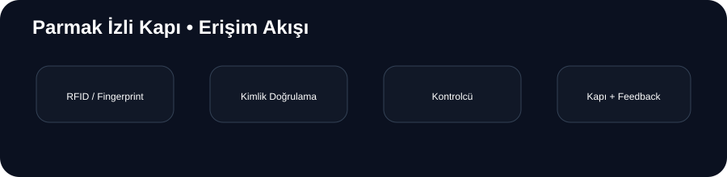

<div align="center">

# 🔐 Parmak İzli Kapı

**RFID + Fingerprint • Arduino • Otomatik Erişim Kontrolü**

Kayıtlı kullanıcıları iki farklı kimlik doğrulama yöntemiyle kontrol eden embedded access-control prototipi.



</div>

---

## ✨ Öne Çıkanlar

- 🔐 Parmak izi doğrulama
- 💳 RFID kart/UID kontrolü
- 🚪 Motor veya röle ile kapı tetikleme
- 📟 20x4 I2C LCD arayüzü
- 🌈 NeoPixel durum geri bildirimi
- 🔊 Buzzer feedback
- 📡 MZ-80 sensör senaryosu

## 🧠 Sistem Mantığı

```text
RFID / Parmak İzi → Kimlik eşleştirme → Yetki kontrolü
                                      ↓
                              ┌───────┴───────┐
                              ↓               ↓
                           Başarılı         Hatalı
                              ↓               ↓
                       Kapıyı tetikle     Reddet + feedback
```

Kimlik doğrulama sonucuna göre LCD, buzzer ve NeoPixel üzerinden kullanıcıya durum bilgisi verilir. Başarılı akışta kapı mekanizması kısa süreliğine tetiklenir.

## 🛠️ Donanım

Arduino • Fingerprint Sensor • RFID RC522 • 20x4 I2C LCD • NeoPixel • MZ-80 • Buzzer • Motor/Röle

## 📚 Kütüphaneler

`Adafruit_Fingerprint` · `RFID` · `SPI` · `Wire` · `LiquidCrystal_I2C` · `Adafruit_NeoPixel`

## ⚙️ Kurulum

1. Arduino IDE'de uygun kartı seçin.
2. Gerekli kütüphaneleri yükleyin.
3. RFID, fingerprint, LCD ve çıkış pinlerini kaynak koduyla eşleştirin.
4. Kendi donanımınızdaki kayıtlı UID/fingerprint değerlerini yerel olarak tanımlayın.
5. Firmware'i karta yükleyip sensörleri ayrı ayrı test edin.

## 🔐 Güvenlik

Gerçek kullanıcı adı, RFID UID veya biyometrik kayıt bilgileri public repository'de paylaşılmamalıdır. Bu proje eğitim/prototip amaçlıdır; üretim erişim sistemlerinde daha güçlü yetkilendirme ve güvenli veri saklama gerekir.

## 📁 Yapı

```text
PARMAK_IZLI_KAPI/
├── parmak_izli_kapi/
│   └── parmak_izli_kapi.ino
├── docs/
│   └── flow.svg
└── README.md
```

## 🚧 Durum

**Prototip / aktif geliştirme**

Gelecek: kullanıcı yönetimi, access logs, kalıcı yetki depolama ve daha modüler driver yapısı.

> Not: Bu depoda ayrı bir LICENSE dosyası belirtilmemiştir.
